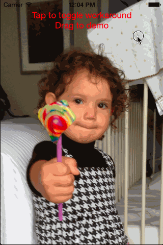

Drag vertically.  Without the workaround, the image moves (which is incorrect behavior).  With the workaround, the image stays in place but disappears from the top down (which is correct behavior).

